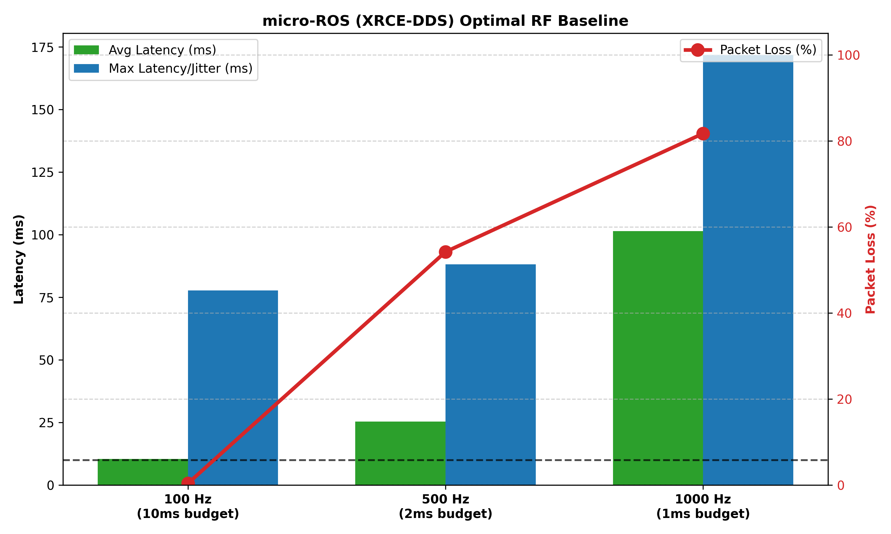
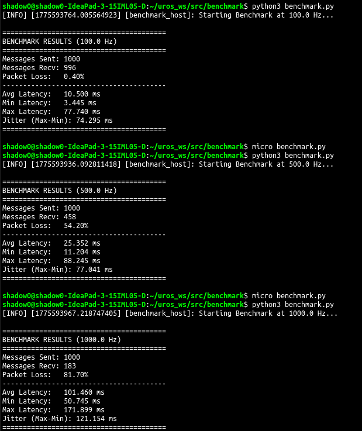

# ros2_control MCU Communication Benchmarks

This repository evaluates the viability of different middleware architectures for bridging resource-constrained microcontrollers into the high-frequency `ros2_control` ecosystem. 

The goal is to determine the maximum sustainable control loop frequency over standard wireless networks by isolating the latency introduced by middleware agents and CDR serialization.

## 🔬 Hardware & Environment Standard
To ensure scientific validity, all three benchmarks share the exact same hardware and network conditions.

* **Microcontroller:** ESP32 WROOM-32 (Rev v3.1, 160MHz Dual Core, 4MB Flash).
* **Host Machine:** Lenovo IdeaPad (Ubuntu 22.04 LTS, ROS 2 Humble).
* **Network:** 2.4 GHz Wi-Fi (Host acting as AP/Hotspot to eliminate router hops and simulate noisy field conditions).
* **Transport:** UDP IPv4.

## ⚙️ Testing Methodology: The Ping-Pong RTT
To accurately simulate a closed-loop `ros2_control` hardware interface, we use a strict Host-driven Ping-Pong Round-Trip Time (RTT) architecture.

1. **Host as Executor:** In `ros2_control`, the Linux host drives the cycle. Therefore, our Python host node acts as the clock, firing a timestamped `std_msgs/Int64` payload at a strict frequency (100Hz, 500Hz, 1000Hz). This simulates the `write()` command to an actuator.
2. **MCU as Reflector:** The ESP32 runs a high-performance subscriber callback. The nanosecond it receives the host's payload, it copies the data and publishes it back. This simulates the `read()` feedback from an encoder.
3. **QoS Profile:** `BEST_EFFORT` is strictly enforced. Reliable QoS (TCP-like retransmission) is detrimental to high-frequency control; if a 1000Hz packet is dropped, we want the next fresh packet, not a delayed retry.

> **Note on Middleware Tuning:** While it is possible to highly optimize XRCE-DDS parameters, MTU sizes, and XML profiles for specific networks, hardware interfaces require a baseline of stability. If a standard out-of-the-box configuration cannot sustain basic loop frequencies without catastrophic failure, the underlying architecture introduces too much overhead for robust generic use.

---

## 📊 Test 1: micro-ROS (XRCE-DDS Baseline) - [COMPLETED]
**Architecture:** `ESP32 (FreeRTOS) -> Micro-XRCE-DDS -> Wi-Fi -> micro_ros_agent (Host) -> DDS -> ROS 2`

This test establishes the baseline performance of the standard agent-based architecture. Every 8-byte integer is CDR serialized on the MCU, wrapped in XRCE, and translated to DDS by the host Agent.

**Results (1000 messages per tier):**

| Target Frequency | Loop Budget | Packet Loss | Avg Latency | Min Latency | Max Latency (Jitter) |
| :--- | :--- | :--- | :--- | :--- | :--- |
| **100 Hz** | 10.0 ms | 2.10% | 17.43 ms | 3.99 ms | 137.76 ms |
| **500 Hz** | 2.0 ms | 75.70% | 168.27 ms | 79.90 ms | 309.51 ms |
| **1000 Hz** | 1.0 ms | 95.20% | 355.93 ms | 182.94 ms | 437.72 ms |

### The RTOS Scheduling (`vTaskDelay`) Experiment
To ensure the bottleneck was the network stack and not FreeRTOS thread starvation, tests were conducted with `vTaskDelay(0)` (a bare busy-wait). 
* At **100Hz**, removing the delay dropped average latency to 17ms. 
* However, at **500Hz and 1000Hz**, the busy-wait starved the LWIP Wi-Fi stack (Core 0), causing the middleware queues to completely overflow. The 95.2% packet loss confirms the throughput limit is dictated by the XRCE-DDS serialization and Agent bridging, not OS scheduling.

**Conclusion:** The standard micro-ROS stack is fundamentally unviable for high-frequency control loops. Even at a modest 100 Hz, the average latency (17.4 ms) exceeds the control budget (10 ms). At 500 Hz and above, the system collapses, rendering the hardware interface dangerously unresponsive.

Click to view raw terminal output

---

## 🚧 Test 2: Pico-ROS (Zenoh + CDR) - [BLOCKED / PENDING UPSTREAM FIXES]

**Architecture:** ESP32 (ESP-IDF/FreeRTOS) -> zenoh-pico -> Wi-Fi -> rmw_zenoh_cpp (Host) -> ROS 2 (Humble/Rolling)

This test aimed to remove the bridging Agent to evaluate peer-to-peer Zenoh communication while retaining ROS 2 message compatibility (CDR serialization). The goal was to isolate the latency penalty of the Agent versus the penalty of CDR serialization.

**Current Status: Blocked by Wrapper Instability**
During extended diagnostic testing, we discovered that the current open-source `Pico-ROS` implementation is fundamentally incompatible with modern ROS 2 stacks and cannot sustain a reliable connection for high-frequency benchmarks. 

We have documented a complete systems autopsy and are currently discussing the fixes with the library maintainers. You can view the full technical breakdown here: [Pico-ROS Issue #19](https://github.com/Pico-ROS/Pico-ROS-software/issues/19)

**Key Architectural Blockers Found:**
* **Type Hash Mismatch:** The library hardcodes `RIHS` type hashes (introduced in Iron/Rolling), breaking native backward compatibility with ROS 2 Humble hosts. 
* **Thread Starvation & Lease Timeouts:** The library relies on an underlying `pthread` background executor to manage Zenoh Keep-Alive packets. Under ESP-IDF v5.2, this POSIX wrapper fails to initialize properly, stalling the background thread. The host router eventually starves and forcefully kills the UDP session every 10–20 seconds.
* **Deprecated Liveliness Tokens (Ghost Node):** Even during brief windows of successful raw UDP byte transmission, the library announces its nodes using an outdated Liveliness Token syntax (`@ros2_lv/...`). Modern `rmw_zenoh_cpp` fails to parse this dialect, rendering the microcontroller a "ghost node" invisible to `ros2 topic list`.

Until these core transport and graph-identity layers are patched in the upstream repository, we cannot extract valid, uninterrupted high-frequency benchmark data.

---

## 🚧Test 3: Clearpath Proton (Protobuf Baseline) - [PENDING]

**Architecture:** ESP32 (C/Protobuf) -> Serial/UDP -> Proton ROS 2 Adapter (Host) -> ROS 2

Following feedback from industry engineers (Clearpath Robotics), this test evaluates the `Proton` protocol. Clearpath abandoned micro-ROS on their production robots in favor of this custom, lightweight Protobuf-based bridge.

This test will determine the absolute maximum throughput achievable when the MCU is stripped of all ROS 2 middleware overhead and only sends highly compressed, serialized bundles to a dedicated host adapter. This serves as our "Speed Limit" baseline for what an optimized embedded transport layer should achieve.

---
## 🚧 Test 4: Raw Zenoh (Zero-Copy Structs) - [IN PROGRESS]
**Architecture:** `ESP32 (Zephyr RTOS) -> zenoh-pico -> Wi-Fi -> zenoh-cpp SystemInterface (Host)`

*This is the proposed GSoC architecture.* It bypasses both the Agent and CDR serialization, mapping raw C-structs directly from Zenoh payloads to the hardware interface memory buffer.
